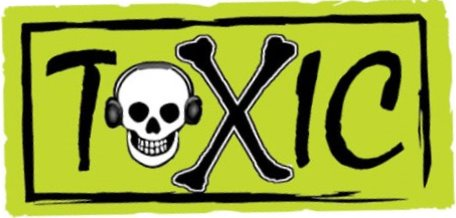
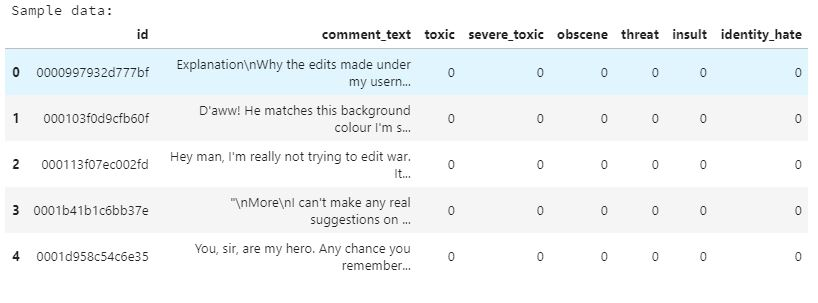

# Toxic Comment Classifier

It is been evident that human psychology is changing; our emotions are getting attached with the likes, comments and tags we receive on the social media. We receive both good and bad comment but the impact of toxic comments is affecting the engagement of the users in the meaningful conversations.
Moreover, users can see others using hateful words, slurs and ideas, and those things are becoming normal but the severity and viciousness of these comments has evolved into something much more sinister such as recent capitol riots at US parliament and attack on farmers by local goons in India.

#### Inspiration
Sharp increase in hateful comments on the farmers who are protesting at the outskirts of India's capital Delhi since October 2020 against the 3 Farm Bills that has been passed by the government in September 2020. Due to rampant toxicity, people are avoiding having meaningful discussion on these bills. Therefore, having a solid toxicity flagging system in place will allow online forums and social media platforms to effectively facilitate conversations.

#### Goal
<br>
To build a Multi-label Multiclass Classification model capable of detecting different level of toxicity like severe toxic, threats, obscenity, insults, and so on for each comment. 

## Getting started
Let's start by cloning the repository by running below command in cmd
<br> `git clone https://github.com/Navjotbians/toxic-comment-classifier.git`

```python
# Import necessary packages
import nltk
import pandas
import numpy
import sklearn
import seaborn
```
Start importing these necessary packages. If you have not installed these packages,you can install them by typing the below command in the terminal.
<br>`pip install requirements.txt`

## Project structure
Project has **5 main sub-directories:** 
* `data/`: Contains `raw/` and `processed/` subdirectories. `raw/` dir contain `training data` and `processed/` dir  is where we store the processed data, a copy of processed data is already saved in this folder. [Click here](https://drive.google.com/drive/folders/1gMJHNxCajYsRzMPjwUuPEM2S5tIp_b3r?usp=sharing) to download the `data ` folder,save it in the `Toxic Comment Classifier/` dir.
* `model/`: Trained models are stored in this folder
* `notebooks/`: Contains the experiments and explainations
* `src/`: Stores all the required scripts
* `templates/`: Form layout for the application is stored here 

## Dataset
 <!-- Links -->
 [Dataset](https://www.kaggle.com/c/jigsaw-toxic-comment-classification-challenge/data) used in this project is the Jigsaw/Conversation AI dataset provided for the Kaggle Toxic Comment Classification Challenge. This dataset contains 159571 Wikipedia comments which have been labeled by human raters for type of toxicity.
 <br>
 <details>
  <summary><b>Click here to see the preview of the dataset</b></summary>
  
  
</details>


## Project Pipeline	
<details>
  <summary><b>Dataset</b></summary> 

  - <kbd>CMD/CTRL</kbd> + <kbd>C</kbd>: to copy
  - <kbd>CMD/CTRL</kbd> + <kbd>V</kbd>: to paste
</details>

<details>
  <summary><b>Exploratory data analysis</b></summary> 

  - <kbd>CMD/CTRL</kbd> + <kbd>C</kbd>: to copy
  - <kbd>CMD/CTRL</kbd> + <kbd>V</kbd>: to paste
</details>

<details>
  <summary><b>Data pre-processing and feature selection</b></summary> 

  - <kbd>CMD/CTRL</kbd> + <kbd>C</kbd>: to copy
  - <kbd>CMD/CTRL</kbd> + <kbd>V</kbd>: to paste
</details>

<details>
  <summary><b>Rule Based Model</b></summary> 

  - <kbd>CMD/CTRL</kbd> + <kbd>C</kbd>: to copy
  - <kbd>CMD/CTRL</kbd> + <kbd>V</kbd>: to paste
</details>

<details>
  <summary><b>AI Model</b></summary> 

  - <kbd>CMD/CTRL</kbd> + <kbd>C</kbd>: to copy
  - <kbd>CMD/CTRL</kbd> + <kbd>V</kbd>: to paste
</details>

<details>
  <summary><b>AI Model</b></summary> 

  - <kbd>CMD/CTRL</kbd> + <kbd>C</kbd>: to copy
  - <kbd>CMD/CTRL</kbd> + <kbd>V</kbd>: to paste
</details>

<details>
  <summary><b>Model Evaluation</b></summary> 

  - <kbd>CMD/CTRL</kbd> + <kbd>C</kbd>: to copy
  - <kbd>CMD/CTRL</kbd> + <kbd>V</kbd>: to paste
</details>

<details>
  <summary><b>Inference</b></summary> 

  - <kbd>CMD/CTRL</kbd> + <kbd>C</kbd>: to copy
  - <kbd>CMD/CTRL</kbd> + <kbd>V</kbd>: to paste
</details>


## Exploratory data analysis


<!-- UL -->
**train.csv** - this file contains comments with their binary labels which tells different type of toxicity. The types of toxicity are :
* `toxic`
* `severe_toxic`
* `obscene`
* `threat`
* `insult`
* `identity_hate`
Dataset is highly imbalanced
<ul>
<li>total samples: 159571</li>
<li>decent samples(negative class): 143346</li>
<li>not-decent comments(positive class): 16225</li> 
<li>ratio of negative class with positive class: 89.8:10.2</li>
</ul>
	<br>These 16225 not-decent comments are are multilabeled under different types of toxic labels
	<ul>
	<li> toxic: 15294
	<li> severe_toxic: 1595
	<li> obscene: 8449
	<li> threat: 478
	<li> insult: 7877
	<li> identity_hate: 1405
	</ul>

With this much skewness in dataset, the model will give default accuracy of 90% in classifying a comment as a decent without learning anything. To overcome this problem we could use stratified K-fold cross validation techniques to make sure this skewness doesn't lead model to produce biased results.
For the same reason, we are not using accuracy as a measure of a model performance, so we will explore alternative matrics that provide better guidance in evaluating and selecting model such as F1 score, Jaccard score, AUC.
<br>Further, pairwise label comparison is done to check if there is any kind of overlap between the features of the two labels, for example, it was noted that all the `severe_toxic` comments are `toxic`
For details run  `eda.ipynb` from `notebooks/` to check the detailed exploration of the data


## Baseline Model
The purpose of this model is to make predictions for all six categories on a comment using some set of rules. To do this, label-wise six datasets are created, then all the words are stored in the dictionary with its occurance count for each dataset. Finally predictions are made by checking the presence of top n words from the frequently used word dictionary, in the comments.
<br>
Minimum accuracy for predicting `toxic `, `severe_toxic `, `obscene `, `threat `, `insult `, or  `identity_hate ` class of the Baseline model is more that 88%.
<br>
Label-wise ccuracies for:
<ol>
<li> toxic: 89.4%</li>
<li> severe_toxic: 88.2%</li>
<li> obscene: 96.3%</li>
<li> threat: 87.8%</li>
<li> insult: 95.8%</li>
<li> identity_hate: 98.3%</li>
</ol>

Based on the rule implimented here, baseline classifier is classifying decent and not-decent comments with the **accuracy of 76.6%**.Now we have to see if AI based models giver better performance than this.
<br>
Run `baseline_model.ipynb` from `notebooks/` to see the details.


## Data pre-processing
A copy of `processed_data.csv` is already saved in `data/proccesed/` dir. In case you want to get the same results go ahead and run `processing.py` from `src/` dir to get the `processed_data.csv`  which will get saved in  `data/proccesed/` dir by dafault, so make sure you have this folder in  `Toxic-comment-classifier/` dir. In case you don't have `data/` folder then make sure to change the path for reading `train.csv` and writing the `processed_data.csv` before running the script.

## ML models 

## Evaluation

